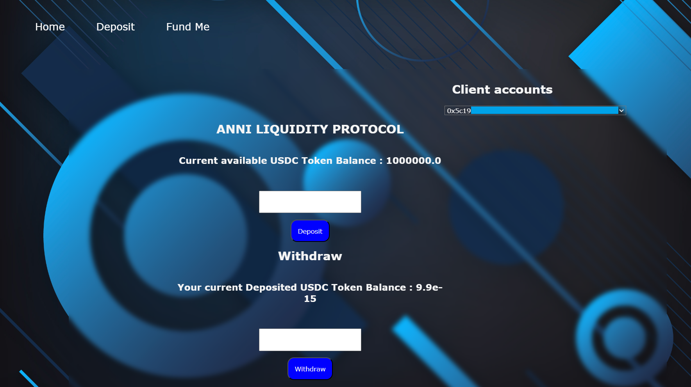

## Проект "DEFI Bank Project on Blockchain" из курса [Solidity Zero to Hero Course](https://www.codiesalert.com/courses/free-solidity-course)



### Создаём virtual environment
```
python -m venv web3_venv
```

### Устанавливаем brownie
```
pip install eth-brownie
```

### Создаём папку
```
mkdir DEFI
cd DEFI
```

### Создаём структуру проекта
```
brownie init
```

### Пишем код
Создаём контракты

### Компилируем
```
brownie compile
```

### Деплой в ganache
```
npm install ganache --global
brownie run scripts/deploy.py
```

### Можно и через консоль
```
brownie console
>>> from brownie import accounts
>>> accounts[0]
...
```

### Просмотр и настройка сетей

Обновим шаблон для alchemy
```
brownie networks update_provider alchemy 'https://eth-{}.g.alchemy.com/v2/$WEB3_ALCHEMY_PROJECT_ID'
brownie networks list_providers True
brownie networks set_provider alchemy
brownie networks list True
```

### Настраиваем параметры

```
pip install python-dotenv
```

Прописываем все значения в .env файле
```
# metamask private keys
PRIVATE_KEY = ""
# PRIVATE_KEY1 = ""
# PRIVATE_KEY2 = ""

# ETHERSCAN_TOKEN = ""

# infura
# WEB3_INFURA_PROJECT_ID = ""
# INFURA_PROVIDER = ""
# INFURA_SECERT = ""

# alchemy
WEB3_ALCHEMY_PROJECT_ID=""
```

### Деплой в Sepolia с помощью ALCHEMY
```
brownie run scripts/deploy.py --network sepolia
```

Добавляем адреса контрактов в .env файл
```
DEFI_CONTRACT_ADDRESS=""
USDC_CONTRACT_ADDRESS=""
```

### Взаимодействие с контрактами
```
brownie run scripts/interact.py --network sepolia
```

### Создаём frontend
```
pip install flask
pip install Flask-WTF
```
Далее в папке Frontend создаём приложение на Flask.